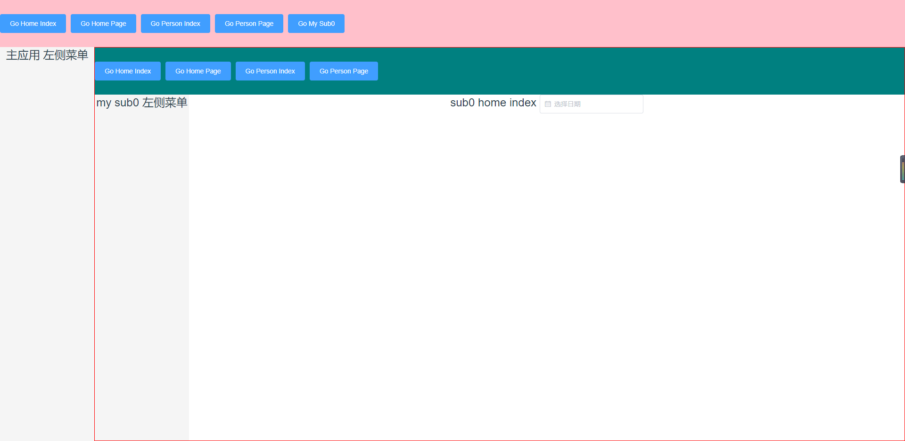

# 微前端

#### micro-app

#### [https://github.com/micro-zoe/micro-app/](https://github.com/micro-zoe/micro-app/)

MicroApp是一款基于类WebComponent进行渲染的微前端框架，不同于目前流行的开源框架，它从组件化的思维实现微前端，旨在降低上手难度、提升工作效率。它是**目前市面上接入微前端成本最低的框架**，并且提供了**JS沙箱、样式隔离、元素隔离、预加载、资源地址补全、插件系统、数据通信**等一系列完善的功能。MicroApp与技术栈无关，也不和业务绑定，可以用于任何前端框架和业务。

# 基座应用

#### jd-base

http://localhost:8080/#/

# 子应用

#### jd-sub0

http://localhost:8030/#/

# DEMO

